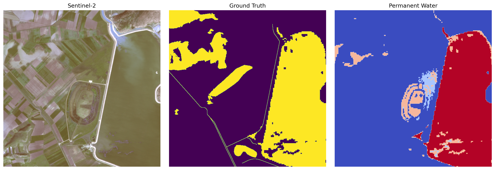

---
license:
  - cc-by-nc-4.0
language:
  - en
tags:
  - remote
  - floods
  - deep-learning
  - sentinel-2
pretty_name: worldfloods
viewer: false
---
<div style="text-align: center; border: 1px solid #ddd; border-radius: 10px; padding: 15px; max-width: 250px; margin: auto; background-color: #f9f9f9;">


  
<b><p>This dataset follows the TACO specification.</p></b>
</div>

<br>


# WorldFloods: A Global Dataset for Operational Flood Extent Segmentation


### Database

**WorldFloods** is a public dataset containing pairs of Sentinel-2 multispectral images (Level-1C) and corresponding flood segmentation masks. As of its latest release, it comprises **509** flood events worldwide, requiring approximately **300 GB** of storage if fully downloaded. The primary goal is to facilitate **automatic flood mapping** from optical satellite data by providing high-quality training and validation samples.

Each **image-mask** pair captures a satellite scene (with all 13 Sentinel-2 bands) and the corresponding **binary flood masks**, refined or curated from authoritative flood extent products by services such as [Copernicus EMS](https://emergency.copernicus.eu/) and [UNOSAT](https://unitar.org/maps). Flood events range from 2016 to 2023, encompassing diverse hydrological conditions and global regions.

### Sensors Used

- **Sentinel-2 MSI (Multispectral Instrument):**
  - 13 spectral bands spanning from visible (VNIR) to shortwave infrared (SWIR).
  - Spatial resolutions of 10 m, 20 m, or 60 m, which are harmonized to 10 m in the dataset for consistent pixel-size alignment.
  - Scenes are **Level-1C** or **Level-2A** reflectance products, further processed with custom or standardized atmospheric corrections (e.g., Sen2Cor) to ensure accurate radiometric signatures.

- **(Optional) Landsat 8/9 OLI:**
  - In some derived workflows, the WorldFloods pipeline and trained models can also ingest **Landsat 8/9** imagery (30 m resolution) for flood segmentation. This is enabled by a specialized version of the model that uses overlapping spectral bands between Sentinel-2 and Landsat.

### Original dataset

1. **Version 1.0.0**  
   - Released with the article: *Towards global flood mapping onboard low cost satellites with machine learning* (Mateo-García et al., 2021).  
   - Covers events from **2016 to 2019**, generated semi-automatically, with only validation and test subsets manually curated.  
   - Offers flood mask products with fewer curated maps than v2.  
   - Total download size: up to **~300 GB** if all subsets (train, val, test) are included.
   - **Google Drive**: A subset of data and pretrained models are shared in a **public Drive folder**.  
   - **Google Cloud Storage**: The GCS bucket is: `gs://ml4cc_data_lake/2_PROD/2_Mart/worldfloods_v1_0/`(Requires a GCP **requester pays** project).  


2. **Version 2.0.0**  
   - **Latest release** accompanying the article:  
     *Global flood extent segmentation in optical satellite images* (Portalés-Julià et al., 2023).  
   - Flood events from **2016 to 2023**, including manually curated flood masks based largely on Copernicus EMS products.  
   - Each sample has **two** binary reference channels: (1) clear/cloud and (2) land/water. This allows cloud-aware flood segmentation.  
   - Total download size: **~76 GB**.  
   - **Hugging Face**: The dataset is hosted under [isp-uv-es/WorldFloodsv2](https://huggingface.co/datasets/isp-uv-es/WorldFloodsv2). 
   - **Zenodo**: Manually curated flood masks, metadata, and additional products (including **Pakistan 2023 flood event** map) are available at [Zenodo, DOI: 10.5281/zenodo.8153514](https://doi.org/10.5281/zenodo.8153514).

## Taco dataset

To facilitate streamlined **data access and usage**, the WorldFloods dataset has been organized into [TACO](https://tacofoundation.github.io/) “tortillas.” Each tortilla file contains **three samples**:

1. **S2**: The multi-band Sentinel-2 image (Level-1C or Level-2A), harmonized to 10 m per pixel.  
2. **PERMANENTWATERJRC**: A reference mask derived from the JRC (Joint Research Centre) permanent water layer.  
3. **GT**: The curated flood extent mask, distinguishing water vs. land, as labeled by Copernicus EMS or other authoritative sources.

All three samples are co-registered over the same bounding box, enabling direct **pixel-wise** comparisons and model training. Each tortilla also includes STAC-like metadata describing the coordinate reference system (CRS), affine transform, time stamps, and other key descriptors.


## 🔄 Reproducible Example

<a target="_blank" href="https://colab.research.google.com/drive/1b_LfmYyJWId3aZ3ikdsB8-VTgAvUee59?usp=sharing">
  
</a>

Load this dataset using the `tacoreader` library.

```python
import tacoreader
import rasterio as rio
import matplotlib.pyplot as plt

# Load the dataset
dataset = tacoreader.load("tacofoundation:worldfloods")

# Read a sample row
idx = 273
row = dataset.read(idx)
row_id = dataset.iloc[idx]["tortilla:id"]

# Retrieve the data
s2_path, per_path, gt_path  = row.read(0), row.read(1), row.read(2)
with rio.open(s2_path) as src_s2, rio.open(per_path) as src_per, rio.open(gt_path) as src_gt:
    window_s2 = rio.windows.Window(10300, 2900, 512, 512)
    window_per = rio.windows.Window(10300, 2900, 512, 512)
    window_gt = rio.windows.Window(10300, 2900, 512, 512)
    
    s2 = src_s2.read([2, 3, 4], window=window_s2)
    per = src_per.read(1, window=window_per)
    gt = src_gt.read(2, window=window_gt)

# Display
fig, axs = plt.subplots(1, 3, figsize=(15, 5))
axs[0].imshow(s2.transpose(1, 2, 0) / 2000)
axs[0].set_title('Sentinel-2')
axs[0].axis('off')
axs[1].imshow(gt, cmap='viridis') 
axs[1].set_title('Ground Truth')
axs[1].axis('off')
axs[2].imshow(per, cmap='coolwarm') 
axs[2].set_title('Permanent Water')
axs[2].axis('off')

plt.tight_layout()
plt.show()
```

<center>
    
</center>


## 🛰️ Sensor information
The sensor related to the dataset: **sentinel2msi**.

## 🎯 Task
The task associated with this dataset: **semantic-segmentatio**

## 💬 Discussion
Insights or clarifications about the dataset: **[https://huggingface.co/datasets/tacofoundation/worldfloods/discussions](https://huggingface.co/datasets/tacofoundation/worldfloods/discussions)**

## 🔀 Split Strategy

Train, test and validation.

## 📚 Scientific Publications

Publications that reference or describe the dataset.

### Publication 01
- **DOI**: [10.1038/s41598-023-47595-7](https://doi.org/10.1038/s41598-023-47595-7)
- **Summary**:  
  This paper presents a novel machine learning framework for operational flood mapping from optical satellite images, addressing issues like cloud coverage and accuracy in flood detection. The model was trained on an extended version of the WorldFloods dataset and validated on globally distributed flood events. It shows superior performance to current operational methods, especially in areas covered by thin clouds. The paper also demonstrates the applicability of this model to map significant recent flood events, such as those in Pakistan and Australia.
- **BibTeX Citation**:
```bibtex
@article{portales-julia_global_2023,
  title = {Global flood extent segmentation in optical satellite images},
  volume = {13},
  issn = {2045-2322},
  doi = {10.1038/s41598-023-47595-7},
  number = {1},
  urldate = {2023-11-30},
  journal = {Scientific Reports},
  author = {Portalés-Julià, Enrique and Mateo-García, Gonzalo and Purcell, Cormac and Gómez-Chova, Luis},
  month = nov,
  year = {2023},
  pages = {20316},
}
```

### Publication 02
- **DOI**: [10.1038/s41598-021-86650-z](https://doi.org/10.1038/s41598-021-86650-z)
- **Summary**:  
  This paper describes the use of machine learning for global flood mapping on low-cost satellites, focusing on the WorldFloods dataset from 2016 to 2019. The dataset was created semi-automatically with a few manually curated flood events. The paper demonstrates the potential of using this dataset for improving flood mapping accuracy using Sentinel-2 and Landsat imagery.
- **BibTeX Citation**:
```bibtex
@article{mateo-garcia_towards_2021,
  title = {Towards global flood mapping onboard low cost satellites with machine learning},
  volume = {11},
  issn = {2045-2322},
  doi = {10.1038/s41598-021-86650-z},
  number = {1},
  urldate = {2021-04-01},
  journal = {Scientific Reports},
  author = {Mateo-García, Gonzalo and Veitch-Michaelis, Joshua and Smith, Lewis and Oprea, Silviu Vlad and Schumann, Guy and Gal, Yarin and Baydin, Atılım Güneş and Backes, Dietmar},
  month = mar,
  year = {2021},
  pages = {7249},
}
```

## 🤝 Data providers

Organizations or individuals responsible for the dataset.

| **Name**                                             | **Role**    | **URL**                                                      |
| :--------------------------------------------------- | :---------- | :----------------------------------------------------------- |
| Universitat de València - Image & Signal Processing Group | producer   | [https://isp.uv.es/](https://isp.uv.es/)                       |
| European Space Agency (ESA)                          | producer   | [https://earth.esa.int/eogateway/missions/sentinel-2](https://earth.esa.int/eogateway/missions/sentinel-2) |
| Copernicus Emergency Management Service (EMS)        | contributor | [https://emergency.copernicus.eu/](https://emergency.copernicus.eu/) |
| United Nations Operational Satellite Applications Team (UNOSAT) | contributor | [https://unitar.org/maps](https://unitar.org/maps)             |
| TACO Foundation                                      | curator     | [https://github.com/tacofoundations/](https://github.com/tacofoundations/) |


## 🧑‍🔬 Curators

Responsible for structuring the dataset in the TACO format.
|**Name**|**Organization**|**URL**|
| :--- | :--- | :--- |
|Julio Contreras|Image & Signal Processing|[https://juliocontrerash.github.io/](https://juliocontrerash.github.io/)|

## 🌈 Optical Bands


